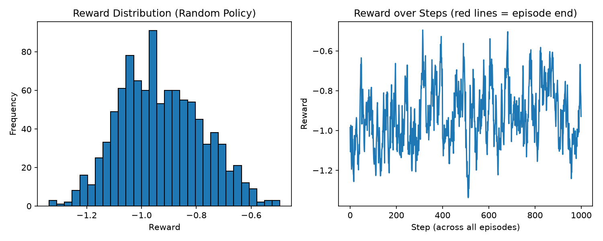
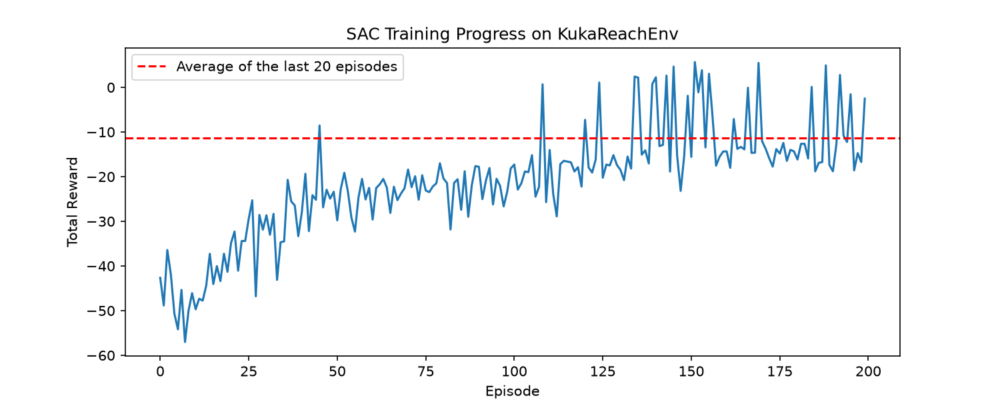
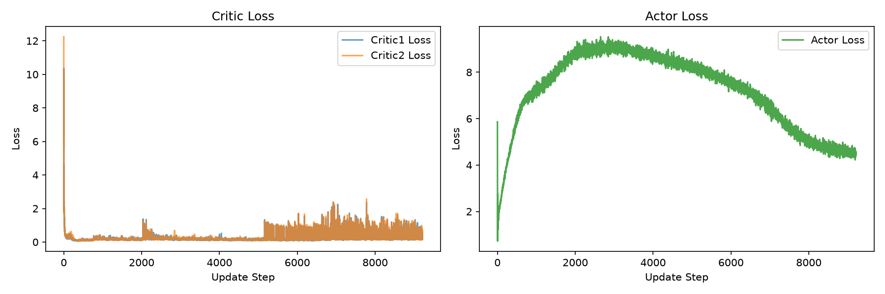
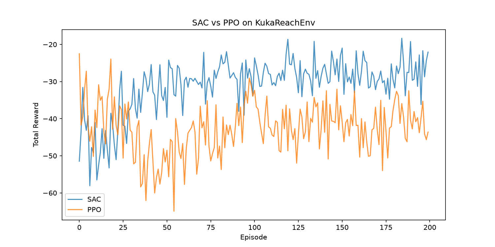

# Sim2Realを見据えたロボットアーム到達制御の強化学習基盤構築

PyBullet + Gymnasium上に自作したKUKAロボットアーム(7軸)の到達(Reach)タスク環境に対し、SAC(Soft Actor-Critic)をフルスクラッチで実装し、学習・検証を行ったプロジェクトです。比較検証として、PPO(Proximal Policy Optimization)も同様に実装し、Optunaによるハイパーパラメータチューニングを含めた、同一条件での性能比較を行いました。

---

## 背景・目的


フィジカルAI・強化学習を成果物として実施しました。


```
【データ作成】──>【シミュレーション】──>【実機検証】
```

のうち、ファーストステップにあたる「データ作成〜バーチャルシミュレーション」領域を、7日間の個人学習として一気通貫で実践しました。

着手にあたっては、MDP・ベルマン方程式・TD法・Q学習/SARSA・DQN・Policy Gradient/Actor-Criticに至るまでの強化学習理論を独学でまとめ直し(`docs/強化学習_学習ノート_SAC追加.pdf`)、その理解を土台にSACの理論整理・実装まで行っています。

---

## 技術構成

| 分類 | 技術 |
|---|---|
| 言語 | Python |
| 深層学習 | PyTorch |
| 環境インターフェース | Gymnasium |
| 物理シミュレーション | PyBullet |
| ハイパーパラメータ最適化 | Optuna |
| 可視化 | Matplotlib |
| 開発環境 | Jupyter Notebook, conda |

---

## 環境設計:KukaReachEnv

PyBulletに同梱されているKUKA IIWA(7軸ロボットアーム)を用い、Gymnasium形式で到達(Reach)タスク環境をゼロから自作しました。

### タスク内容
エンドエフェクタ(アーム先端)を、エピソードごとにランダム配置されるターゲット位置まで到達させる。

### 観測空間(34次元)

| 内容 | 次元数 | 意図 |
|---|---|---|
| 関節角度 | 7 | 基本情報 |
| 関節角速度 | 7 | 基本情報 |
| エンドエフェクタ位置 | 3 | 基本情報 |
| エンドエフェクタ姿勢(クォータニオン) | 4 | 到達時の向きも考慮した、実践的なタスク設計 |
| ターゲット位置 | 3 | 基本情報 |
| 相対位置ベクトル(target − EE位置) | 3 | 学習の安定化・高速化のため独自に追加 |
| 直前の行動 | 7 | 動きの滑らかさを学習させるため独自に追加(実機を意識) |

### 行動空間(7次元)
各関節への角度指令(連続値、-1〜1に正規化)

### 報酬設計
```
reward = -(エンドエフェクタとターゲットの距離)
distance < 0.05 で成功、成功ボーナスを加算
```

### スコープの絞り込み
Pick and Place(把持・搬送)まで含めると接触判定・成功条件の設計が複雑化し、期限内完成のリスクが高まるため、今回は到達(Reach)タスクに意図的に絞りました。設計上、より複雑なタスクへの拡張は可能です。

---

## アルゴリズム選定理由

ロボットアームの関節制御は連続値制御であり、離散行動を前提とするアルゴリズムではそのまま適用できません。連続値制御に対応した深層強化学習アルゴリズムとして、以下の観点からSACを選定しました。

- **off-policy**:リプレイバッファにより過去の経験を再利用でき、シミュレーションコストが高いロボット制御タスクにおいてサンプル効率で有利
- **最大エントロピー強化学習**:収益に加えてエントロピーも最大化することで、探索を保ちながら学習が進む
- **Twin Q-networkによる過大評価の抑制**、**Polyak平均によるTarget Networkの安定した追従**など、学習を安定させる工夫が理論的に組み込まれている

比較検証として、on-policyの代表的手法であるPPOも実装し、実際に性能を比較しました(後述)。

---

## SAC実装のポイント

- **Actor**:状態から行動の確率分布(平均・標準偏差)を出力。Reparameterization trickにより微分可能な形でサンプリングし、tanhで行動を[-1, 1]に押し込め(squashed Gaussian)、tanh変換に伴う確率密度の補正項を実装
- **Twin Q-network**:独立した2つのCriticを用意し、ターゲット値計算時に小さい方を採用することで、Q値の過大評価を抑制
- **Target Network**:DQNのような定期的なハードコピーではなく、Polyak平均による毎ステップの緩やかな追従を採用
- **エントロピー正則化**:Criticのターゲット値計算・Actorの目的関数の両方に、エントロピー項(`-α logπ`)を組み込み

全て理論から独自にフルスクラッチで実装しています(`sac_agent.py`)。

---

## 学習結果

Optunaによるハイパーパラメータチューニングを、SAC・PPOともに実施しました。評価指標は「直近20エピソードの平均報酬」とし、得られた最良のハイパーパラメータについて、乱数の初期値による結果のブレを考慮し、SAC・PPOともに同一条件で5回ずつ再学習を実施し、平均と標準偏差を算出しました。

### ランダム方策 vs SAC・PPO(Optuna最適化後)



上図は学習前(ランダム方策)における、1エピソード(50ステップ)あたりの報酬の分布(左)と推移(右)です。改善の仕組みを持たないため、報酬は-46.44前後を中心に分布しています。

| | 1エピソードあたりの平均報酬 |
|---|---|
| ランダム方策 | -46.44 |
| PPO(Optuna最適化後、5回平均) | -32.51 ± 6.47 |
| SAC(Optuna最適化後、5回平均) | **-12.07 ± 4.53** |

ランダム方策と比較して、SACは約74%の改善が見られました。



学習序盤で急速に改善し、エピソード100以降は、報酬がプラス圏(成功)に到達する頻度が増えていく傾向が見られます。

### Critic / Actor Lossの推移



学習序盤、Critic Lossは急速に収束しますが、学習率を高めに設定した影響か、学習後半にかけて再びLossの変動が見られました。報酬(学習曲線)自体は大きく改善しており方策の実質的な性能向上にはつながっているものの、より長期的な学習の安定性については、追加の検証余地があると考えています。

### SAC vs PPO



SACはPPOと比較して、改善幅・結果の安定性(標準偏差の小ささ)の両面で優位という結果になりました。これは、off-policy(SAC、リプレイバッファでデータを再利用できる)とon-policy(PPO、収集データを都度使い捨てる)という、両アルゴリズムの理論的特性差を裏付けるものであり、本プロジェクトでSACを主軸に選定した判断の妥当性を、複数回の試行を踏まえた統計的な観点からも実証しています。

---

## Sim2Realへの工夫:ドメインランダム化

実機との差異(Sim-to-Realギャップ)を見据え、`KukaReachEnv`のリセット時に重力の大きさへ意図的なランダム性(-10.1〜-9.5)を導入しました。単一の固定条件に過学習しない、頑健な方策学習を狙った設計です。導入後も学習の収束性は維持されることを確認しています。

---

## データ収集基盤

ランダム方策によるシミュレーション実行から、状態・行動・報酬・次状態(s, a, r, s')をエピソード単位で収集し、npz形式で保存する基盤を構築しました(`collect_data.py`)。収集したデータの可視化(報酬分布・推移)も実装しています。案件業務フローにおける「データ作成」ステップに対応する取り組みです。

---

## 今後の展望

- **学習の長期化による、さらなる改善の検証**:今回は200エピソードでの検証にとどめたが、学習曲線を見る限り、特にPPOはon-policyの制約上、同一エピソード数内での学習機会がSACより少なく、より長期の学習によって差が縮まる可能性がある。SACについても、チューニング後の学習後半にLossの変動が見られたため、学習率のさらなる調整や、より長期での安定性検証が今後の課題
- **タスクの拡張**:Reachタスクから、Pick and Placeなどより実践的なタスクへの拡張
- **実機検証**:シミュレーションで学習した方策の、実ロボットでの動作検証とSim2Realギャップの実測

---

## ディレクトリ構成

```
.
├── kuka_reach_env.py         # KukaReachEnv(環境自作)
├── sac_agent.py               # SAC実装(Actor, Twin Critic, ReplayBuffer, SACAgent)
├── ppo_agent.py                # PPO実装(ActorCritic, RolloutBuffer, PPOAgent)
├── collect_data.py             # データ収集パイプライン
├── train_kuka.py               # KukaReachEnv + SAC 学習実行
├── train_kuka_ppo.py           # KukaReachEnv + PPO 学習実行
├── tune_hyperparams.py         # SAC ハイパーパラメータチューニング(Optuna)
├── tune_hyperparams_ppo.py     # PPO ハイパーパラメータチューニング(Optuna)
├── visualize_losses.py         # Loss可視化
├── compare_results.py          # ランダム方策 vs SAC 比較
├── compare_sac_ppo.py          # SAC vs PPO 比較
├── docs/
│   └── 強化学習_学習ノート_SAC追加.pdf  # 強化学習理論ノート(MDP〜SAC)
└── README.md
```

---

## セットアップ

```bash
conda create -n rl_env python=3.11
conda activate rl_env
conda install -c conda-forge pybullet
pip install torch torchvision gymnasium numpy matplotlib h5py optuna
```

```bash
# データ収集
python collect_data.py

# SAC学習
python train_kuka.py

# PPO学習(比較用)
python train_kuka_ppo.py

# ハイパーパラメータチューニング(任意)
python tune_hyperparams.py
python tune_hyperparams_ppo.py
```
